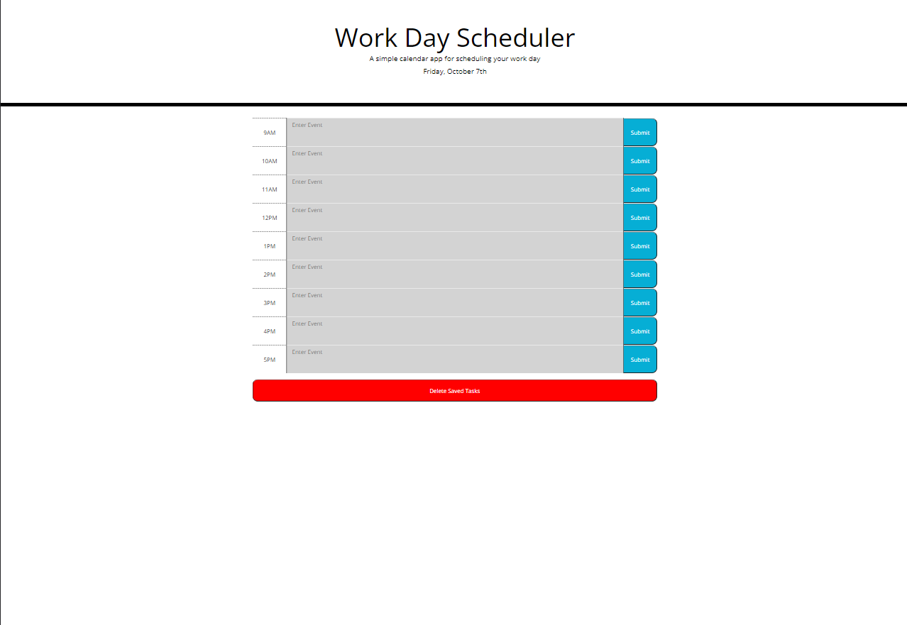
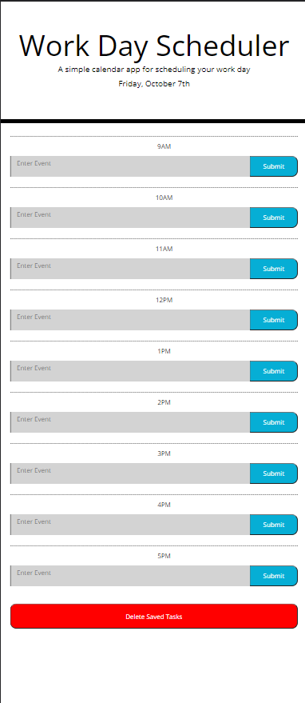
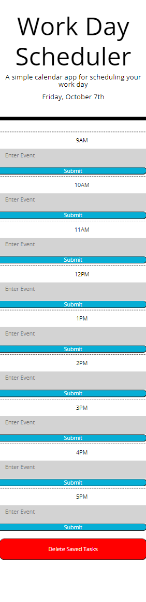

# Challenge 5

## Description

The goal of this project was to create a task management website where the user can store daily tasks in hour blocks and save their tasks to the page.

## Usage

To use this web app, the user must simply type whatever task they wish to store in the text box and hit save when completed. The app will save all values to local storage on each save. If the user wishes to clear all tasks at once, there is a delete button to clear local storage and refresh the page.

## License

Please see the attatched readme in my repo.

## Credits
<ul>
<li>https://api.jquery.com/each/</li>
</ul>

## Features
<ul>
<li>Text areas for inputting tasks with placeholder text.</li>
<li>Fucnctional responsive buttons to save user input.</li>
<li>Additional button for resetting all user input.</li>
<li>Website is responsive from small mobile screens to 4k.</li>
</ul>

<u>Mockup<u>

<u>Desktop Resolution<u>

<u>Tablet Resolution<u>

<u>Mobile Resolution<u>

